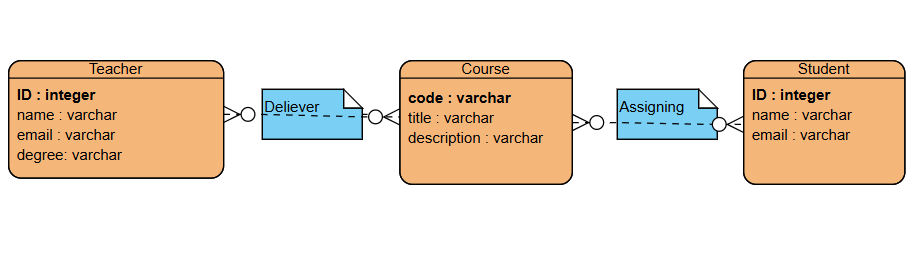

# University Course Management System (W3-A3)

## Project Overview
This project implements a University Course Management System using
Object-Oriented Programming (OOP) and a relational database design.
The system is based on the provided ER diagram and models the
relationships between Teachers, Students, and Courses.

Teachers are responsible for delivering courses, while students can
enroll in multiple courses. The system demonstrates proper use of
many-to-many relationships through junction tables and follows
database normalization principles.

---

## Scenario Description
The university needs a system to manage academic information related
to teachers, students, and courses. Each teacher can deliver one or
more courses, and each course may be delivered by one teacher. Students
can enroll in multiple courses, and each course can have many students
enrolled.

The system stores this information in a SQLite database and provides
queries to:
- Count the number of students enrolled in a specific course (MSE800)
- List all teachers who are teaching a specific course (MSE801)

---

## ER Diagram

## Database Design
The database is designed using an Entity Relationship Diagram (ERD)
that includes the following entities:

### Entities
- **Teacher** (id, name, email, degree)
- **Student** (id, name, email)
- **Course** (code, title, description)

### Relationships
- **Deliver**: Represents the relationship between Teacher and Course
- **Assign**: Represents the many-to-many relationship between Student and Course

The ER diagram is included in this repository as an image file.

---

## Technologies Used
- Python 3
- SQLite3
- Object-Oriented Programming (OOP)

---
