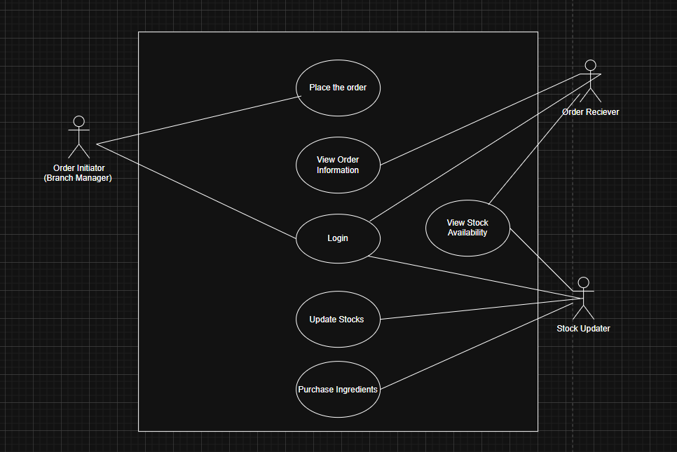
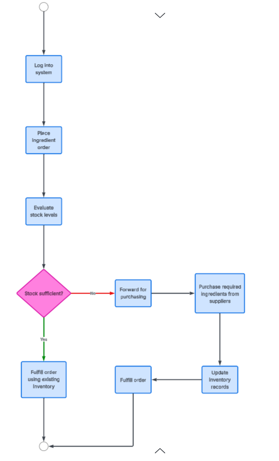

## Scenario Description

The use case supports ingredient ordering and inventory management for a chain restaurant.

- A Branch Manager logs into the system to access ordering functions.

- The manager checks stock availability for required ingredients.

- If stock levels are low, the manager places an ingredient order.

- The Order Receiver reviews and processes the order details.

- Ingredients are purchased from suppliers.

- The Stock Updater updates inventory records after ingredients are received.

The process ensures continuous availability of ingredients and accurate stock tracking across branches.The system ensures that only authorized users can access specific features after logging in.

## Use Case Diagram 

----

## Activity Diagram Description

Workflow Explanation:

The activity diagram illustrates the ingredient ordering process in a chain restaurant from the branch manager’s perspective. The process begins when the branch manager logs into the system and places an ingredient order based on branch requirements. After the order is submitted, the system evaluates the current stock level internally. If the available stock is sufficient, the order is fulfilled using existing inventory and the process ends. If the stock is not sufficient, the order is forwarded for purchasing, where the required ingredients are bought from suppliers. Once the ingredients are obtained, the inventory records are updated accordingly. The activity concludes after the order is successfully fulfilled, ensuring efficient ordering while avoiding unnecessary purchases.

## Activity Diagram

